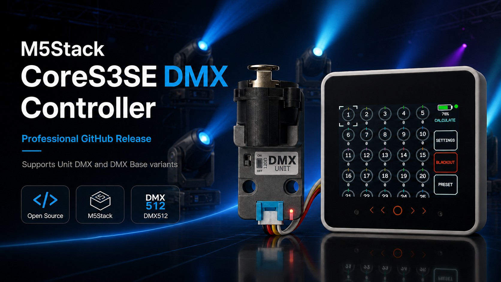
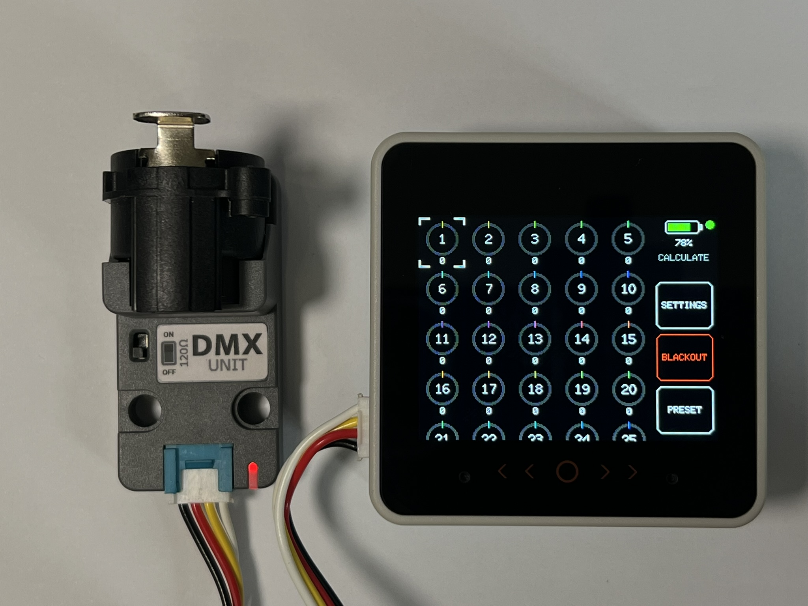
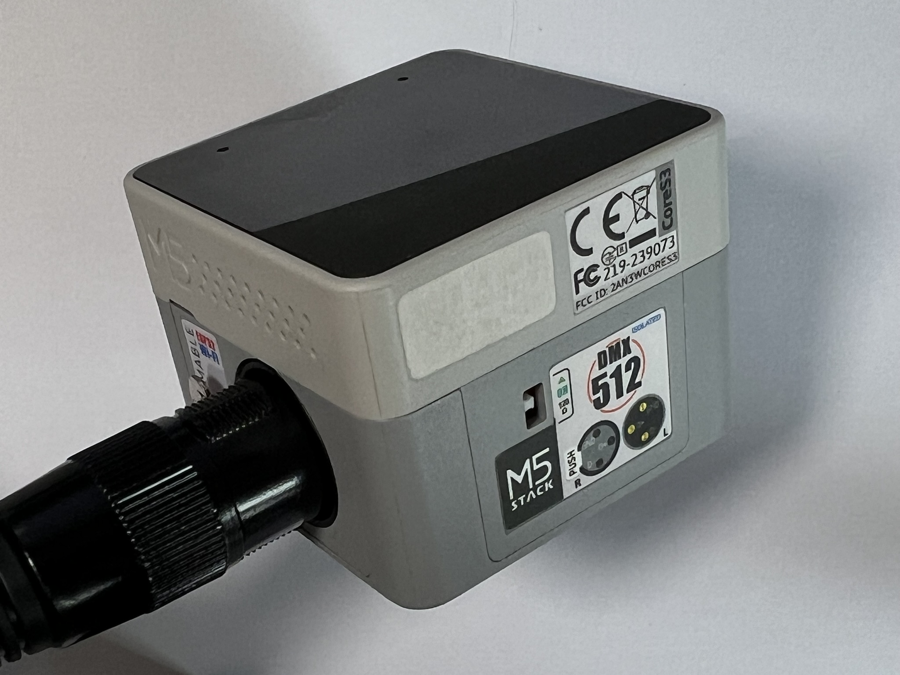
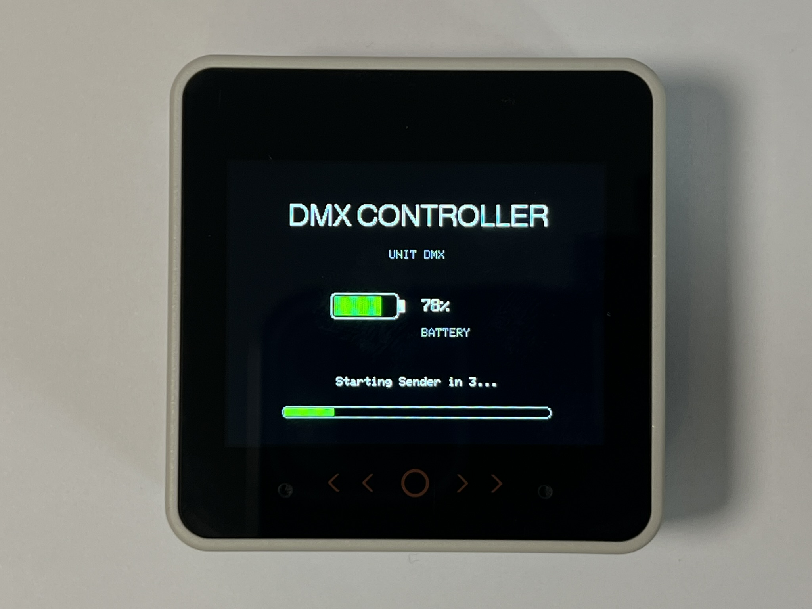
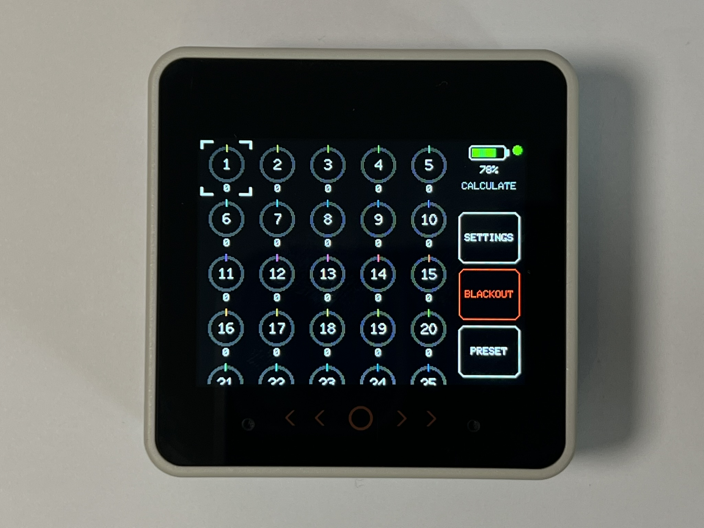
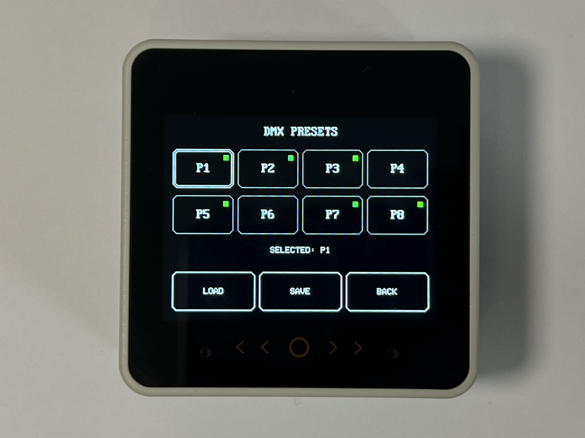
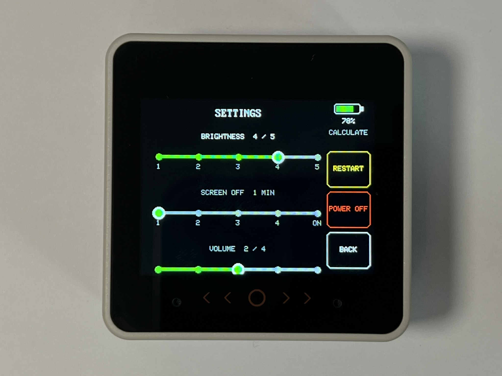

# M5Stack CoreS3SE DMX Controller


A **portable, small-form-factor ESP32-S3 DMX512 controller** built around the
**M5Stack CoreS3SE**. It provides a battery-powered touchscreen interface for
controlling a full **512-channel DMX universe**, with presets, blackout,
battery monitoring and support for **M5Stack Unit DMX** and **DMX Base** hardware.

The project started from M5Stack's official **DMX512Tools** example and has been extensively modified into a practical standalone controller with a redesigned touchscreen UI, persistent presets, blackout, battery monitoring, settings, software restart/power-off, and support for two DMX hardware profiles.

> [!IMPORTANT]
> **Recommended / tested setup:** M5Stack CoreS3SE + M5Stack Unit DMX (U183) + M5GO Bottom3.

> [!WARNING]
> **Base DMX support is currently experimental.**
>
> On the Base DMX unit tested during development, random DMX output glitches could be reproduced even with static channel values and simplified test firmware. The same CoreS3SE, fixtures and cabling operated without those glitches when using Unit DMX. This is currently being investigated with M5Stack support and should not be interpreted as a claim that all Base DMX units are affected.

---

<table>
  <tr>
    <td align="center">
      <br>
      <b>CoreS3SE DMX Controller</b>
    </td>
  </tr>
</table>

<table>
  <tr>
    <td align="center">
      ><br>
      <b>CoreS3SE + Unit DMX</b>
    </td>
    <td align="center">
      <br>
      <b>CoreS3SE + Base DMX</b>
    </td>
  </tr>
</table>

### Application Screens

<table>
  <tr>
    <td align="center">
      <br>
      <b>Startup Screen</b>
    </td>
    <td align="center">
      <br>
      <b>Main DMX Screen</b>
    </td>
  </tr>
  <tr>
    <td align="center">
      <br>
      <b>Presets</b>
    </td>
    <td align="center">
      <br>
      <b>Settings Screen</b>
    </td>
  </tr>
</table>

---

## Features

- Full **512-channel DMX universe**
- Touchscreen channel selection and value editing
- Persistent **P1-P8 presets**
- Protected preset save using hold-to-save
- Preset **copy** and **clear**
- **Blackout** with double-tap protection
- DMX activity / heartbeat indicator
- Battery percentage display
- Charging and external-power indication
- Battery runtime estimation after calibration
- Low-battery visual and audible warnings
- Persistent display brightness setting
- Persistent screen timeout setting
- Persistent UI volume setting
- Screen always-on option
- Startup sound / chime
- Software **RESTART**
- Software **POWER OFF**
- Double-tap protection for restart and power-off
- Separate hardware profiles for:
  - **M5Stack Unit DMX U183**
  - **M5Stack Base DMX**

---

## Hardware

### Recommended Setup

- [M5Stack CoreS3SE](https://docs.m5stack.com/en/core/M5CoreS3%20SE)
- [M5Stack Unit DMX U183](https://docs.m5stack.com/en/unit/Unit-DMX)
- [M5Stack M5GO Bottom3](https://docs.m5stack.com/en/module/M5GO3%20Bottom)

The M5GO Bottom3 contains a **3.7 V / 500 mAh** battery. In the tested controller configuration, practical runtime was approximately **5 hours**, depending on display brightness, activity and battery condition. **Note that, battery is requered for DMX operation!**

### Experimental Hardware

- [M5Stack Base DMX](https://docs.m5stack.com/en/base/DMX_Base)

---
# Functions

## Presets

Eight presets are available:

```text
P1 P2 P3 P4
P5 P6 P7 P8
```

Preset data is stored persistently in ESP32 NVS.

### Save

Saving is protected against accidental taps.

- Select a preset
- Hold the SAVE control for approximately 1 second
- Progress is shown while holding
- Releasing early cancels the save

### Copy / Clear

Long-press an occupied preset slot to open preset options.

Available operations:

- `COPY`
- `CLEAR`
- `BACK`

Copying is only allowed to an empty destination slot.

Clearing is protected by a hold action.

---

## Blackout

BLACKOUT uses double-tap protection.

```text
First tap  -> TAP AGAIN
Second tap -> BLACKOUT
```

The second tap must arrive within approximately **500 ms**.

When blackout is activated, the current DMX universe is preserved and zero values are transmitted.

Double-tapping again restores the previous values.

---

## Settings

The Settings screen provides:

### Brightness

Five levels:

```text
1 / 2 / 3 / 4 / 5
```

### Screen Timeout

```text
1 / 2 / 3 / 4 / ON
```

`ON` means the display remains on continuously.

### Volume

Five positions:

```text
0 / 1 / 2 / 3 / 4
```

`0` is mute.

### Software Power Controls

The Settings screen also contains:

```text
RESTART
POWER OFF
BACK
```

Both RESTART and POWER OFF require a double tap within approximately **500 ms**.

Before restart / shutdown, the firmware sends several all-zero DMX frames.

---

## Battery Monitoring

The UI displays:

- Battery percentage
- Charging status
- External-power status
- Estimated remaining runtime

Battery indicator colors:

| Battery Level | Color |
|---|---|
| 36-100% | Green |
| 21-35% | Yellow |
| 0-20% | Red |

Runtime estimation begins only after enough discharge data has been collected.

The estimator uses a rolling observation window and smooths the calculated runtime so the displayed value does not jump excessively.

Low-battery warnings are generated at approximately:

- **20%**
- **10%**

Battery-warning tones use a fixed high warning volume independent of the normal UI volume.

---

## DMX Hardware Profiles

The application code is shared. Hardware-specific UART / direction-control settings are selected by the PlatformIO build environment.

### Unit DMX U183

The Unit DMX is connected to **CoreS3SE Port A**.

| Signal | CoreS3SE GPIO |
|---|---:|
| DMX TX | GPIO 2 |
| DMX RX | GPIO 1 |
| Direction / Enable | `-1` |
| Port | Port A |

The Unit DMX handles the RS-485 direction internally, therefore the firmware does not use a separate enable pin.

Example configuration:

```cpp
transmitPin = GPIO_NUM_2;
receivePin  = GPIO_NUM_1;
enablePin   = -1;
```

### Base DMX

The Base DMX uses the CoreS3 M-Bus UART / enable pins used by M5Stack's original DMX512Tools example.

| Signal | CoreS3SE GPIO |
|---|---:|
| DMX TX | GPIO 7 |
| DMX RX | GPIO 10 |
| RS485 Enable | GPIO 6 |

Example configuration:

```cpp
transmitPin = GPIO_NUM_7;
receivePin  = GPIO_NUM_10;
enablePin   = GPIO_NUM_6;
```

---

## PlatformIO Build Environments

Suggested environment names:

```text
cores3se_unit
cores3se_base
```

### Build Unit DMX version

```bash
pio run -e cores3se_unit
```

### Upload Unit DMX version

```bash
pio run -e cores3se_unit -t upload
```

### Build Base DMX version

```bash
pio run -e cores3se_base
```

### Upload Base DMX version

```bash
pio run -e cores3se_base -t upload
```

---

## Software Dependencies

The project is built with PlatformIO and uses:

- [M5Unified](https://github.com/m5stack/M5Unified)
- [M5GFX](https://github.com/m5stack/M5GFX)
- [esp_dmx](https://github.com/someweisguy/esp_dmx)

The current application branch was developed around **esp_dmx v2.02** because it matches the API used by the original application.

### CoreS3SE compatibility note

With esp_dmx v2.02 on newer ESP32-S3 toolchains, the library may require compatibility changes in `dmx_ll.h` for renamed ESP-IDF UART register members.

The changes used during development were:

```cpp
hw->uart_idle_conf_reg_t.tx_idle_num
```

to:

```cpp
hw->idle_conf.tx_idle_num
```

```cpp
hw->uart_txbrk_conf_reg_t.tx_brk_num
```

to:

```cpp
hw->txbrk_conf.tx_brk_num
```

and:

```cpp
hw->uart_status_reg_t.rxd
```

to:

```cpp
hw->status.rxd
```

---

## Roadmap

Possible future development:

- ESP-NOW wireless DMX transmitter mode
- Small ESP32 / AtomS3 wireless DMX receiver
- Link-quality / RSSI indicator
- Wireless receiver pairing
- Multiple receiver support
- Art-Net / sACN support
- CRMX-compatible hardware exploration
- Fixture profiles
- Named channels
- Preset export / import
- Additional battery statistics

---

## Original Source / Acknowledgements

This project is based on and heavily extended from the official M5Stack:

### [DMX512Tools example](https://github.com/m5stack/M5Module-DMX512/tree/master/examples/DMX512Tools)

from the:

### [M5Stack M5Module-DMX512 repository](https://github.com/m5stack/M5Module-DMX512)

The upstream M5Stack repository is distributed under the **MIT License**.

Many thanks to **M5Stack** for publishing the original DMX512Tools example and making it available for further development.

---

## License

This project is released under the **MIT License**.

Because this project is derived from M5Stack's MIT-licensed DMX512Tools example, the original M5Stack copyright and MIT license notice must be retained for portions derived from the upstream source.

A repository `LICENSE` file should therefore preserve the upstream MIT notice and clearly identify the additional modifications / contributions made in this project.

Example attribution wording:

```text
Original DMX512Tools source:
Copyright (c) M5Stack

Additional modifications and project-specific code:
Copyright (c) 2026 Zoltan Somogyvari
```

---


## Contributing

Issues, test results and pull requests are welcome.

For Base DMX testing, useful reports should include:

- exact M5Stack host model
- Base DMX revision if known
- power supply
- fixture model
- termination configuration
- firmware build environment
- esp_dmx version
- whether the issue also occurs with static DMX values

Please avoid reporting a Base DMX issue as confirmed hardware failure unless the problem has been isolated with reproducible testing.

---

## Disclaimer

DMX512 controls lighting and related equipment. Test new firmware in a safe environment before using it during a live event.

This project is an independent community project and is **not an official M5Stack product**.
